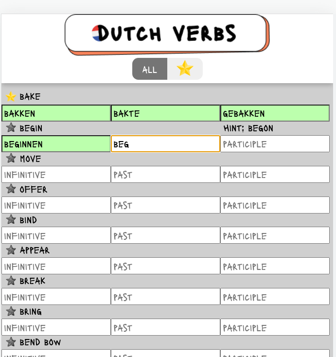

# Dutch verbs with VueJS

This is a simple VueJS test made while watching this Udemy course (https://www.udemy.com/course/vuejs-2-the-complete-guide/)

### Try it online or on your machine
- Online: https://dutch-verbs-vue.vercel.app/
- Local:
  - Run in your terminal `npm run serve`
  - Go to the url that prints in the terminal. For example: http://localhost:8080/

### Figma for frontend
https://www.figma.com/file/KaP3t23u3XC2GUlQxZBh5H/dutch-verbs-vercel?node-id=0%3A1

### Throubleshooting

#### 1. ES-Lint

Failed to compile.
8:1   error  Expected indentation of 1 tab but found 2 spaces   indent
9:1   error  Expected indentation of 1 tab but found 2 spaces   indent

#### Solution: 

run in terminal: eslint --fix "./src/**"
or
run npm lint

---
#### 2. The "numberCounter" property should be a constructor

#### Solution:
You need to specify the prop type:

props: {
isTabsEnabled: {
type: Boolean,
default: true
}
}

